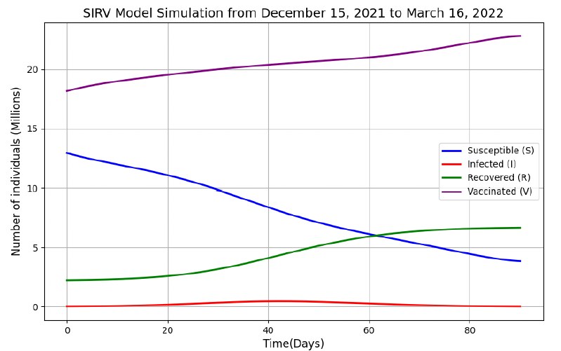
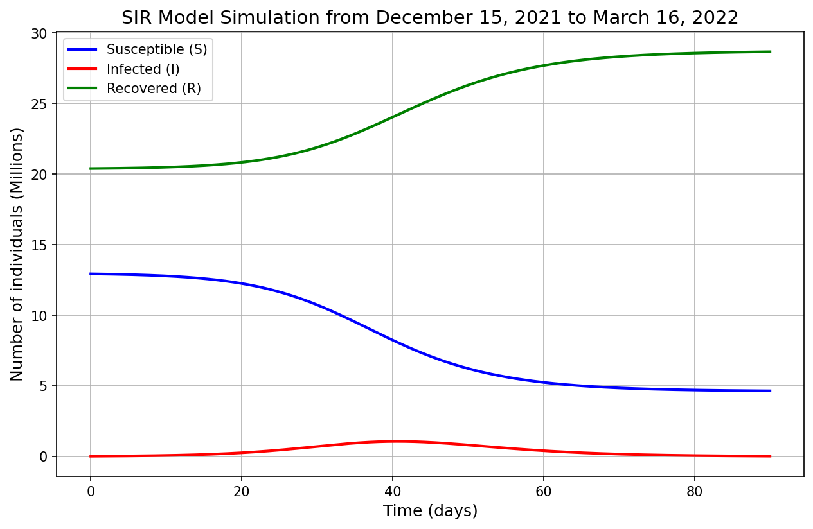
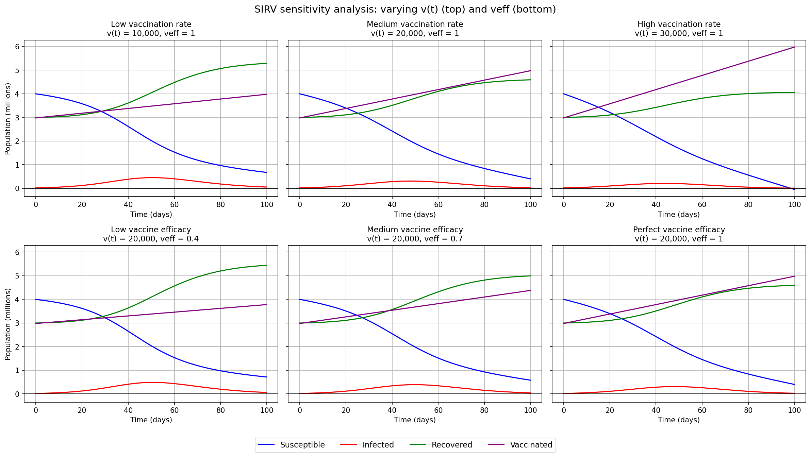

# SIRV model of COVID-19 vaccination impact in Peru

> **Note:** This README's summary of the essay's methodology and results was drafted
> with the help of Claude AI, for clarity and to avoid publishing the full essay
> text. `initial_conditions.py`, `results.py`, `sir_simulation.py` and
> `sensitivity_analysis.py` were cleaned up from the essay's appendix code with
> Claude's help; the model, data, parameters and results are the essay's.
> The essay PDF itself is not included in this repository.

Extends the standard SIR epidemiological model with a vaccinated compartment (V)
to estimate how much Peru's vaccination programme reduced infections during the
third wave, 15 December 2021 – 16 March 2022.

Written for an IB Mathematics Extended Essay (2025).

## Model

### SIR (no new vaccination)

Each person is susceptible (S), infected (I) or recovered (R), with total
population $N = S + I + R$ held constant:

```math
\begin{aligned}
\frac{dS}{dt} &= -\beta \frac{SI}{N} \\
\frac{dI}{dt} &= \beta \frac{SI}{N} - \gamma I \\
\frac{dR}{dt} &= \gamma I
\end{aligned}
```

$\beta$ is the transmission rate and $\gamma$ the recovery rate (the inverse of
the average infectious period).

### SIRV (with vaccination)

Adds a vaccinated-immune compartment V, with $N = S + I + R + V$:

```math
\begin{aligned}
\frac{dS}{dt} &= -\beta \frac{SI}{N} - v_{\text{eff}}\, v(t) \\
\frac{dI}{dt} &= \beta \frac{SI}{N} - \gamma I \\
\frac{dR}{dt} &= \gamma I \\
\frac{dV}{dt} &= v_{\text{eff}}\, v(t)
\end{aligned}
```

$v(t)$ is the daily number of second doses and $v_{\text{eff}}$ the fraction of
second-dose recipients who become immune. The vaccination rate is a degree-5
polynomial fitted to `vaccinations_peru.csv` ($R^2 = 0.557$), with $t$ in days
from 15 December 2021:

```math
v(t) = -0.00115\,t^5 + 0.24004\,t^4 - 17.88265\,t^3 + 602.54558\,t^2 - 10052.19822\,t + 120899.04357
```

### Numerical solution (Euler's method)

With step $\Delta t = 0.1$ days and 900 steps ($t_{n+1} = t_n + \Delta t$):

```math
\begin{aligned}
S_{n+1} &= S_n + \left(-\beta \frac{S_n I_n}{N} - v_{\text{eff}}\, v(t_n)\right)\Delta t \\
I_{n+1} &= I_n + \left(\beta \frac{S_n I_n}{N} - \gamma I_n\right)\Delta t \\
R_{n+1} &= R_n + \gamma I_n \,\Delta t \\
V_{n+1} &= V_n + v_{\text{eff}}\, v(t_n)\,\Delta t
\end{aligned}
```

### Parameter fitting (least squares)

$\beta$ and $\gamma$ minimise the sum of squared differences between the
model's infected curve and the 37 observed active-case counts, using SciPy's
L-BFGS-B optimizer:

```math
\min_{\beta,\,\gamma}\; \sum_{i=1}^{37} \left[ I_{\beta,\gamma}(t_i) - I_{\text{real}}(t_i) \right]^2
```

### Initial conditions (t = 0, 15 December 2021)

```math
\begin{aligned}
N &= 33{,}350{,}300 \\
I_0 &= 19{,}035 \\
V_0 &= 0.872 \times 20{,}827{,}350 = 18{,}161{,}449 \\
R_0^{\text{SIRV}} &= 2{,}236{,}351 \\
S_0 &= N - I_0 - R_0 - V_0 = 12{,}933{,}465 \\
R_0^{\text{SIR}} &= R_0^{\text{SIRV}} + V_0 = 20{,}397{,}800
\end{aligned}
```

0.872 is the average of Pfizer (0.95) and Sinopharm (0.7934) efficacy, used only
for $V_0$. For $t \ge 0$, $v_{\text{eff}} = 0.95$. See `initial_conditions.py`.

### Measuring the effect of vaccination

```math
\text{Total infections} = I(90) + R(90) - R_0
```

```math
\text{Reduction} = \frac{\text{Total}_{\text{SIR}} - \text{Total}_{\text{SIRV}}}{\text{Total}_{\text{SIR}}} \times 100\%
```

## Results

Fitted parameters: β = 0.951, γ = 0.231

|                          | SIR (no new vaccination) | SIRV (with vaccination) |
| ------------------------ | ------------------------ | ----------------------- |
| Peak active cases        | 1,065,611             | 459,925                  |
| Total infections, 90 days| 8,302,462             | 4,460,496                |

Second doses given during the wave averted an estimated **3,841,966 infections
(46.3% reduction)** and lowered the peak by **605,686** active cases. The
counterfactual is "no new vaccination after 15 December 2021": people already
vaccinated before then are treated as immune in both scenarios (see Data below),
so this measures the effect of vaccination *during* the third wave, not of the
whole vaccination programme.





## Sensitivity analysis

Before fitting to Peru, the model was tested on a hypothetical population
(N = 10,000,000, β = 0.5, γ = 0.1) by varying the vaccination rate v(t) with
v_eff = 1, then varying v_eff with v(t) = 20,000. A higher vaccination rate or
efficacy lowers the infection peak. At v(t) = 30,000 the susceptible population
goes negative, a limitation of the model: it keeps removing v_eff·v(t) people
per day even after S reaches zero.



## Scripts

- `initial_conditions.py` — derives S0, I0, R0, V0 for both models from the source data
- `fit_parameters.py` — fits transmission (β) and recovery (γ) rates to the 37 real
  active-case observations using least-squares minimisation with SciPy's L-BFGS-B optimizer
- `sirv_simulation.py` — solves the four-compartment SIRV system via Euler's method (Δt = 0.1, 900 steps)
- `sir_simulation.py` — solves the SIR (no new vaccination) model
- `sir_vs_sirv.py` — runs both models on the same fitted parameters
- `results.py` — prints the peak, total-infection and averted-infection numbers above
- `sensitivity_analysis.py` — varies v(t) and v_eff on a hypothetical population

## How to run

```
pip install -r requirements.txt
python initial_conditions.py
python fit_parameters.py
python results.py
python sensitivity_analysis.py
```

## Data

- `active_cases_peru.csv` — 37 active-case observations (Worldometer)
- `vaccinations_peru.csv` — 91 days of daily second-dose administrations in Peru, from
  La República's LR Data vaccination tracker ("Así avanzó la vacunación contra la
  COVID-19 en Perú")
- `vaccination_fit.png` — Excel trendline used to derive the degree-5 polynomial v(t)
  fed into the simulation as the vaccination rate

Initial conditions come from Peru's National Institute of Statistics (N = 33,350,300),
Worldometer case counts, and reported Pfizer/Sinopharm efficacy rates. t = 0 is set
at 15 December 2021, the start of the third wave, not the start of the pandemic —
so the model begins with a substantial pre-existing recovered and vaccinated
population rather than a fully susceptible one.

R0 (initial recovered) for the SIRV model is the cumulative case count from 15 days
before t0, reflecting an assumed 15-day recovery period. For the counterfactual SIR
model (no new vaccination), R0 is that same figure *plus* V0 — everyone who had already
received a second dose before t0 is folded into "recovered" instead, since the
no-vaccination scenario needs somewhere to place people who are already immune for
either reason while keeping the total population N constant.

## Assumptions

**Inherited from the standard SIR model:**
- Total population N is constant — no births, deaths, or migration
- Contact between susceptible and infected individuals, and thus new infections, is
  proportional to S·I, scaled by transmission rate β and normalised by N
- Infected individuals recover at a constant rate γ (equivalent to a fixed average
  infectious period)
- No incubation period — individuals are infectious immediately upon infection

**Added for the SIRV extension:**
- Only second-dose recipients count as "vaccinated," to avoid double-counting people
  who received both doses
- Of second-dose recipients, only a fraction v_eff develop full immunity; that
  fraction becomes immune immediately (no delay for immune response to develop)
- Vaccinations are drawn only from the susceptible (S) compartment — the model
  assumes no already-infected or already-recovered individuals received a second
  dose during the simulation window
- Once immune via vaccination, individuals (like recovered individuals) cannot be
  reinfected or vaccinated again

## Limitations

Constant population, permanent immunity after infection or vaccination, immediate
immunity post-dose, and no latency period. Only 37 reported data points across 90
days, so the fitted curve underestimates the observed peak — visible in the first
figure above. Initial conditions (S0, R0, V0) rely on several simplifying
assumptions since the simulation starts mid-pandemic rather than at the initial
outbreak, which likely underestimates S0 by overestimating R0 and V0 — especially
given waning immunity, which the model does not account for.

## Notes

The optimizer setup was adapted from a Stack Overflow discussion on least-squares
SIR fitting; the Euler implementation follows a Plus Maths article.

The vaccination rate function v(t) is a degree-5 polynomial trendline fitted in
Excel to `vaccinations_peru.csv` (R² = 0.557, a moderate fit given daily reporting
noise); see `vaccination_fit.png`. Vaccine efficacy (v_eff = 0.95) is based on
Pfizer's efficacy alone for the ongoing simulation (t ≥ 0), even though Sinopharm
was also administered during this period — a simplification for tractability. A
separate blended Pfizer/Sinopharm efficacy (0.872) was used only once, to calculate
V0, the count of already-immune vaccinated individuals before t0.
